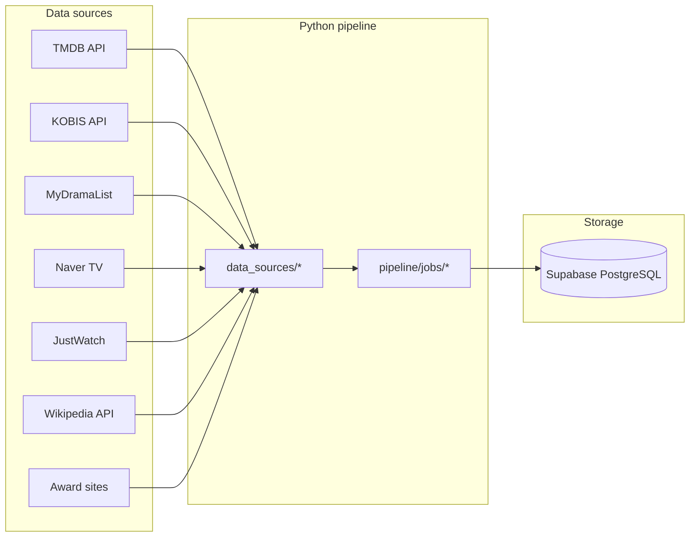

# Korean Movies & TV Data Pipeline

This repository builds and maintains a **multi-source database of Korean film and television** by ingesting public data from **English- and Korean-facing sources**—a mix of **official REST APIs**, **structured open APIs**, and **browser-backed scraping** where sites are JS-heavy or expose no stable API. Everything is normalized into one schema and written to **Supabase**.

**Scheduling**: Production runs use **GitHub Actions** only (cron + manual dispatch). Hosted workflow orchestrators were considered, but **Prefect Cloud-style hosting would have meant ongoing cost**, so this project standardizes on free CI minutes + repository secrets instead.

A **MCP-oriented read layer** fits naturally on top: `db/queries.py` is documented as what an MCP server would call for reads, while ingestion uses the service role for writes.

---

## Problem this project solves

- **Fragmentation**: The same title might appear under English marketing names, 한글 극장/방송 명칭, romanization variants, TMDB IDs, and domestic ticketing or portal IDs. Data quality comes from deliberately **triangulating** multiple languages and ecosystems—not from a single “Korean Netflix” dump.
- **Stale data**: Airing schedules, Nielsen-style episode ratings, MDL scores, weekly box office, and streaming catalogs all drift daily or weekly; the answer is **repeatable ingestion**, not one-off scraping.
- **Consistent spine**: **TMDB** seeds core **movies** and **tv_shows** (`tmdb_id` upserts). Korean-official (**KOBIS**) and Korean-portal (**Naver**) layers attach domestic truth; fan and international portals (**MyDramaList**) and aggregators (**JustWatch**) add audience and availability angles; **Wikipedia** adds long-form English context.

The intended outcome is a **queryable, incrementally updated** store suitable for recommendations, research, or tooling—without tying everything to manual laptop runs.

---

## Data sourcing: English vs Korean, API vs scrape

Rough cut of **language / audience posture** versus **technical access**:

| Source | Audience / language skew | Access | Why it’s in the mix |
|--------|---------------------------|--------|---------------------|
| **TMDB** | Global; metadata often English-first | Stable **REST API** + API key | Broad coverage, IDs, genres, posters, cast—best **canonical join key** (`tmdb_id`) for films and series. |
| **KOFIC / KOBIS** | Korea official film industry | **Open API** (keyed) | **Authoritative Korean box office** (admissions, ranks, screens)—not reproducible from English fan wikis. |
| **Naver** (search / TV aggregation) | Korea domestic portal; **Korean UI** | **Scraping** (Playwright) | Episode-level **시청률** and OST linkage—data types called out explicitly in [`data_sources/naver_tv.py`](data_sources/naver_tv.py) as poorly available elsewhere. |
| **MyDramaList** | International K-drama fans; English-heavy | **Scraping** (Playwright) | Strong for **genre tags, MDL ratings, airing status**, and discovery URLs when matched back to TMDB-backed rows. |
| **JustWatch** | Territory-specific availability UI | **Scraping** (Playwright) | **Where-to-watch** by region/provider; inherently UI-driven. |
| **Wikipedia** (English) | Long-form encyclopedic English | **MediaWiki REST** + courteous `User-Agent` | Plot and sectioned article text [`data_sources/wikipedia.py`](data_sources/wikipedia.py) for richer context than one-line TMDB overviews. |
| **Awards** | Mixed; ceremony sites vary | HTTP + Playwright depending on site | Structured **award / nominee rows** tied to titles when linkage resolves. |

**Deliberately bilingual Korean + English sourcing** avoids two common traps: English-only catalogs that quietly drop domestic-only releases or use wrong romanization, and Korean-only portals that never attach the global ID graph your product needs (`tmdb_id`, cast, images).

Additional modules exist for experiments or future enrichment (e.g. [`data_sources/hancinema.py`](data_sources/hancinema.py), [`data_sources/rottentomatoes.py`](data_sources/rottentomatoes.py), empty job stubs)—they are **not** on the current GitHub schedules unless you wire them.

### Challenges that showed up with this mix

- **Stable identifiers**: Korean portals use internal IDs (**e.g. Naver `os=` show id**) that are not TMDB IDs. The pipeline persists multiple foreign keys (`mdl_id`, `naver_show_id`, `kobis_movie_code`, …—see [`db/models.py`](db/models.py)) and resolves links when ingestion order and title matching allow.
- **Sites that refuse “simple HTTP”**: Naver and MDL are **JavaScript-rendered**; `requests` + BeautifulSoup alone are insufficient. **Playwright in CI** (each workflow installs Chromium before scraper jobs—see [nightly.yml](.github/workflows/nightly.yml)) trades reliability for cold start time and runner complexity.
- **Brittle selectors**: Scrapers break when markup or A/B tests change. Keeping fetch logic in **`data_sources/`** (thin) separate from **`pipeline/jobs/`** (business rules + DB mapping) limits the blast radius when a site moves a div.
- **Date and rating semantics**: Episode air dates may omit years; ratings differ by audience (ticket buyers vs netizens vs MDL stars vs TMDB 10‑point). The schema uses **explicit per-source rating column names** to avoid bogus “average of averages.”
- **Rate limits & etiquette**: APIs (TMDB, KOBIS, Wikipedia) have documented limits; scrapers rely on delays and retries ([`pipeline/utils.py`](pipeline/utils.py)). Production batch sizes are tuned partly around **being polite** and partly around GitHub job timeouts.

---

## Architecture (high level)



- **`data_sources/`**: Low-level fetchers—`requests` / `httpx` for APIs, **Playwright** where the DOM is JS-driven. Keep these modules **thin** (network + parsing) so breakages are localized.
- **`pipeline/jobs/`**: Per-source **sync jobs** that map normalized dicts into the DB shape and call `db.queries` upserts. The Python files still use **Prefect `@flow` / `@task` decorators** from an earlier design; they are **not** deployed to Prefect Cloud here—GitHub Actions simply runs the same entrypoints as plain Python processes.
- **`db/models.py`**: Field documentation and naming conventions (source-prefixed ratings, etc.); **not** an ORM—column contracts for upserts.
- **`db/queries.py`**: The **only** place that talks to Supabase. Writes use **upsert** so scheduled runs are idempotent.
- **`scripts/run_*.py`**: Thin entrypoints invoked by **GitHub Actions** (and usable locally); each script calls the exported flow function for one source with CI-friendly limits.
- **`pipeline/orchestrator.py`**: Composes multiple jobs into **initial**, **nightly**, and **weekly** sequences—handy locally; CI mostly mirrors the same ordering via separate workflow jobs and `needs:` edges.

---

## Scheduled runs (GitHub Actions)

**Why not a hosted orchestrator:** Prefect Cloud (or similar) would add **subscription/hosting cost** for always-on schedules and workers. **GitHub Actions** provides cron, secrets, parallelism, logs, and `workflow_dispatch` for manual reruns within the constraints of public-runner minutes and job timeouts—which is enough for this pipeline.

Workflows live under [`.github/workflows/`](.github/workflows/). **Cron schedules use the default GitHub timezone: UTC.**

| Workflow | Trigger | What it runs |
|----------|---------|--------------|
| [**Nightly Sync**](.github/workflows/nightly.yml) | `0 2 * * *` (02:00 UTC daily) + manual | TMDB → MyDramaList → Naver TV (sequential jobs) |
| [**Weekly Sync**](.github/workflows/weekly.yml) | `0 6 * * 1` (06:00 UTC Mondays) + manual | KOBIS → then JustWatch, Wikipedia, and Awards in parallel after KOBIS |
| [**Initial Population**](.github/workflows/initial_population.yml) | Manual only; requires input `confirm: yes` | Long-running seed: TMDB, MDL, KOBIS history, Naver TV, JustWatch, Wikipedia, Awards (see workflow for job graph) |

The **nightly** chain matches the idea “fast-moving data first”: new/updated TMDB rows, MDL community and status fields, then Naver episode metrics for airing titles.

The **weekly** jobs target slower-moving or heavier sources: official box office, streaming availability, Wikipedia text, and awards.

**Manual runs**: Each workflow supports `workflow_dispatch`, so you can trigger a sync from the Actions tab without waiting for the cron.

---

## GitHub repository secrets

Configure these in **Settings → Secrets and variables → Actions** (names must match the workflows):

| Secret | Used for |
|--------|----------|
| `TMDB_API_KEY` | TMDB API |
| `KOBIS_API_KEY` | Korean Film Council (KOBIS) Open API |
| `SUPABASE_URL` | Supabase project URL |
| `SUPABASE_ANON_KEY` | Reserved for read-only clients (e.g. MCP); workflows currently pass it for consistency |
| `SUPABASE_SERVICE_ROLE_KEY` | Pipeline writes (bypasses RLS); required by `db/queries.py` |

**Local development**: Create a `.env` file in the repo root (gitignored) with the same variable names. `python-dotenv` loads it in `db/queries.py` and several data sources.

---

## What lands in the database (by source)

Mapping from the sourcing strategy above to **Supabase tables** (column-level detail: [`db/models.py`](db/models.py)):

| Source | Primary tables / artifacts |
|--------|----------------------------|
| TMDB | `movies`, `tv_shows`, `people`, cast links |
| KOBIS | Box office history linked to `movies` via `kobis_movie_code` when resolved |
| MyDramaList | `tv_shows` enrichment (ratings, tags, status, slugs, …) |
| Naver TV | `episodes`, OST album rows |
| JustWatch | `streaming` (per region / provider) |
| Wikipedia | `synopsis_full`, `wiki_sections` on movies/shows |
| Awards | Award / nominee records + FKs to titles when matched |

**Not on the current Action schedules:** [`data_sources/hancinema.py`](data_sources/hancinema.py), [`data_sources/rottentomatoes.py`](data_sources/rottentomatoes.py), and stubs [`pipeline/jobs/sync_hancinema.py`](pipeline/jobs/sync_hancinema.py) / [`sync_kmdb.py`](pipeline/jobs/sync_kmdb.py)—the schema still reserves e.g. `hancinema_slug` and Rotten Tomatoes–style columns for optional future jobs.

---

## Database model (logical)

Authoritative field lists and provenance notes are in [`db/models.py`](db/models.py). The query/upsert API is in [`db/queries.py`](db/queries.py).

Core entities include:

- **`movies`**, **`tv_shows`** — primary titles; upsert keys center on `tmdb_id`.
- **`people`**, cast join tables — from TMDB credits.
- **`episodes`** — per-show episode metrics (e.g. Naver).
- **`streaming`** — availability by region and provider (JustWatch).
- **`awards`** / related nominee storage — ceremony history.
- **Box office** — KOBIS weekly/daily style history linked to films.

Ratings are **named by source and audience** (e.g. `tmdb_rating` vs `mdl_rating` vs `naver_audience_rating`) to avoid mixing incompatible scales.

---

## Repository layout

```
├── .github/workflows/     # Nightly, weekly, initial population
├── data_sources/          # Site/API clients
├── db/
│   ├── models.py          # Column contracts + documentation
│   └── queries.py         # Supabase reads/writes
├── pipeline/
│   ├── jobs/              # Per-source sync jobs (still use Prefect decorators; GHA runs them as scripts)
│   ├── orchestrator.py    # Composed initial / nightly / weekly runs for local use
│   └── utils.py           # Shared parsing, delays, retries
├── scripts/               # Entrypoints invoked by GitHub Actions + local runs
├── tests/                 # Per-source tests
├── requirements.txt       # Runtime deps (includes `prefect` for decorator compatibility)
├── requirements-scraper.txt  # Pinned scraper stack (subset; CI uses requirements.txt)
└── prefect.yaml           # Leftover project metadata; scheduling is not Prefect-driven
```

---

## Local setup

**Requirements**: Python **3.12** (matches CI).

```bash
python3.12 -m venv .venv
source .venv/bin/activate   # Windows: .venv\Scripts\activate
pip install -r requirements.txt
playwright install chromium   # needed for MDL, Naver TV, JustWatch, Awards jobs
```

Create `.env` with at least:

- `TMDB_API_KEY`
- `KOBIS_API_KEY`
- `SUPABASE_URL`
- `SUPABASE_SERVICE_ROLE_KEY`

Run a single job from the repo root (same pattern as Actions):

```bash
PYTHONPATH=. python scripts/run_sync_tmdb.py
PYTHONPATH=. python scripts/run_sync_mdl.py
```

To run a **multi-source chain** locally (same ordering idea as Actions, without YAML):

```bash
PYTHONPATH=. python -m pipeline.orchestrator nightly    # default if no arg
PYTHONPATH=. python -m pipeline.orchestrator weekly
PYTHONPATH=. python -m pipeline.orchestrator initial   # very long; prefer splitting or running scripts one by one
```

Note: Limits in `orchestrator.py` may differ slightly from the `scripts/run_*.py` entrypoints GitHub invokes—compare both when debugging parity with CI.

---

## Testing

Tests live under `tests/` and are organized by source. From the project root:

```bash
PYTHONPATH=. python tests/test_tmdb.py
# … or use pytest if you have it installed
```

---

## Operations notes

- **Idempotency**: Upserts on natural keys (`tmdb_id`, etc.) mean re-runs update rather than duplicate core rows.
- **Rate limiting**: `pipeline/utils.py` provides `polite_delay` and retry helpers; respect site terms and API quotas when increasing limits.
- **Cost & runtime**: Initial population workflows use **up to 360 minutes** per job where configured; GitHub-hosted runners can still time out on extreme loads—tune batch sizes in each job if needed.
- **Security**: Never commit `.env` or service role keys. The service role key must only run in trusted environments (CI secrets or your own runner).

---

## Related documentation in code

- [`data_sources/`](data_sources/) — raw API/scrape implementations; start here when a source breaks or Terms change.
- [`pipeline/orchestrator.py`](pipeline/orchestrator.py) — chained initial / nightly / weekly order for local runs.
- [`db/models.py`](db/models.py) — what each column means and which upstream source owns it.
- [`db/queries.py`](db/queries.py) — Supabase reads/writes for downstream consumers (including MCP servers).

If you add an MCP server package, keep **reads** on the anon key with RLS policies, and **writes** restricted to this pipeline using the service role in CI.
